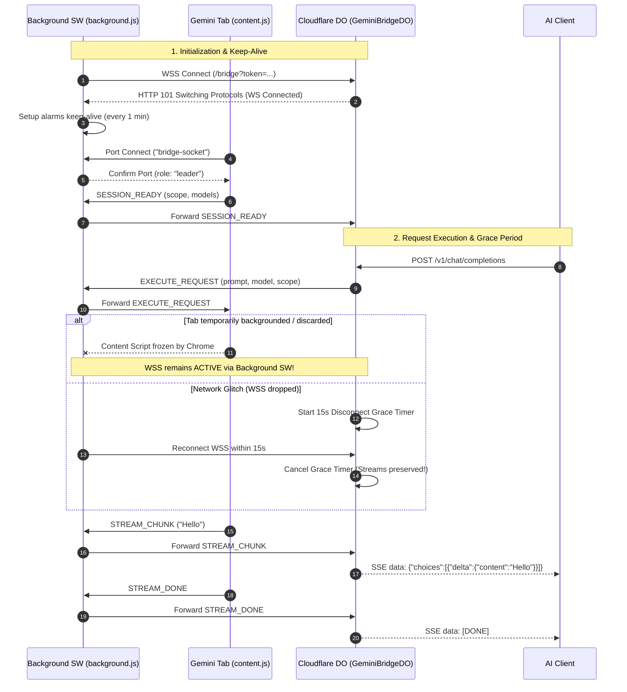
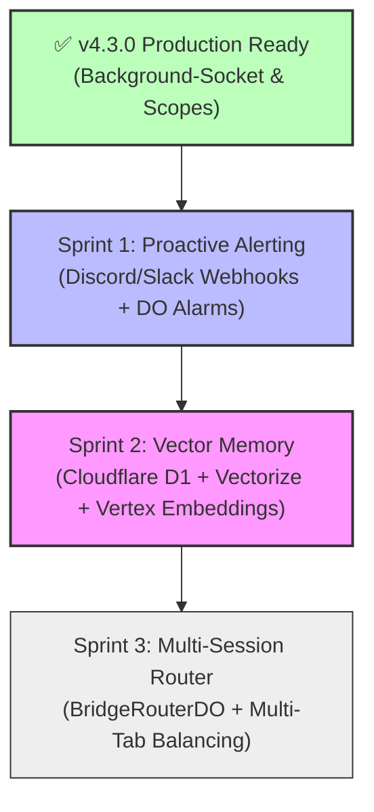

# 🧭 Master Project Handoff & Architecture Blueprint

> **Gemini Web Bridge (Edge AI Gateway & Hybrid Hub)**  
> **Current Version:** `v4.3.0` (Background-Socket Sessions & Conversation Scopes Edition)  
> **Repository:** `gemini-web-bridge` | **Production URL:** `https://gemini-web-bridge.pphothidaen.workers.dev`  
> **System Status:** Production Ready & 100% Operational  
> **Test Pass Rate:** **69 / 69 Tests (100% GREEN)** across Unit, Protocol, and Red Team Adversarial Suites  
> **Last Verified Date:** 2026-09-16  

---

## 📑 สารบัญ (Table of Contents)

1. [ภาพรวมระบบและสถานะปัจจุบัน (System Overview & Current Baseline)](#1-ภาพรวมระบบและสถานะปัจจุบัน-system-overview--current-baseline)
   * 1.1 วัตถุประสงค์และการทำงานหลัก
   * 1.2 แผนผังสถาปัตยกรรมระดับสูง (Architecture Diagram)
   * 1.3 สถาปัตยกรรมส่วนประกอบ 4 ชั้น (4-Layer Extension + Edge Hub)
   * 1.4 สถานะความพร้อมของ Endpoints (Live Endpoints & Diagnostics)
2. [Wire Protocol v2 & การจัดการเซสชัน (Protocol Specification)](#2-wire-protocol-v2--การจัดการเซสชัน-protocol-specification)
   * 2.1 ข้อความสื่อสารระหว่าง Edge Hub ↔ Chrome Extension
   * 2.2 วงจรชีวิตของเซสชันและการป้องกัน Tab Discard
   * 2.3 Disconnect Grace Period & Real SSE Streaming
3. [ระบบ Conversation Scopes: Gemini App vs NotebookLM](#3-ระบบ-conversation-scopes-gemini-app-vs-notebooklm)
   * 3.1 ความสำคัญและประโยชน์ของ Conversation Scope
   * 3.2 การจำแนกประเภท URL และกลไก SPA Detection
   * 3.3 การสลับ Scope อัตโนมัติและเครื่องมือ `set_bridge_scope`
4. [คู่มือการใช้งาน Remote MCP Tools ทั้ง 8 รายการ](#4-คู่มือการใช้งาน-remote-mcp-tools-ทั้ง-8-รายการ)
   * 4.1 รายการเครื่องมือและ Input Schemas
   * 4.2 ตัวอย่าง JSON-RPC Requests & Responses
5. [ประวัติการพัฒนาและงานที่เสร็จสิ้น (Completed Milestones)](#5-ประวัติการพัฒนาและงานที่เสร็จสิ้น-completed-milestones)
   * 5.1 ตารางประวัติ Milestones (v1.0.0 → v4.3.0)
   * 5.2 การแก้ไขปัญหาเสถียรภาพ 5 ประการใน v4.3.0
6. [แผนงานระยะต่อไป (Forward Planning Roadmap: Sprints 1, 2, 3)](#6-แผนงานระยะต่อไป-forward-planning-roadmap-sprints-1-2-3)
   * 6.1 Sprint 1: Proactive Alerting & Health Automation
   * 6.2 Sprint 2: Context Persistence & Vector Memory (D1 + Vectorize)
   * 6.3 Sprint 3: Multi-Session Load Balancing (`BridgeRouterDO`)
7. [คู่มือการปฏิบัติงาน (Operational Runbook)](#7-คู่มือการปฏิบัติงาน-operational-runbook)
   * 7.1 การติดตั้ง Extension ใน Chrome
   * 7.2 การ Deploy Cloudflare Worker ด้วย Wrangler
   * 7.3 การทดสอบระบบอัตโนมัติ (Automated Test Execution)
   * 7.4 คำสั่งทดสอบการใช้งานจริง (Live Verification Commands)
   * 7.5 การตรวจสอบบันทึกการทำงาน (Log Streaming via `wrangler tail`)
8. [คู่มือการแก้ไขปัญหาและรับมือเหตุขัดข้อง (Troubleshooting Guide)](#8-คู่มือการแก้ไขปัญหาและรับมือเหตุขัดข้อง-troubleshooting-guide)
9. [ตาราง Environment Secrets & Configurations](#9-ตาราง-environment-secrets--configurations)
10. [กฎเหล็กและข้อบังคับความปลอดภัย (Guardrails Reference G1-G5)](#10-กฎเหล็กและข้อบังคับความปลอดภัย-guardrails-reference-g1-g5)

---

## 1. ภาพรวมระบบและสถานะปัจจุบัน (System Overview & Current Baseline)

### 1.1 วัตถุประสงค์และการทำงานหลัก

**Gemini Web Bridge** คือ Edge-to-Browser AI Gateway ที่ทำหน้าที่เป็นสะพานเชื่อมต่อโปรโตคอลระหว่าง **AI Clients ภายนอก** (เช่น Hermes Agent, Cursor, Cline, Claude Code, Python SDK, cURL) เข้ากับ **เว็บเซสชันของ Google Gemini จริงที่ล็อกอินแล้ว** บน Google Chrome

ระบบทำงานผ่าน 2 เทคโนโลยีหลัก:
1. **Cloudflare Workers & Durable Objects (`GeminiBridgeDO`):** ทำหน้าที่เป็น Edge Hub ศูนย์กลาง ให้บริการ OpenAI-compatible REST API (`/v1/chat/completions`), Remote MCP Protocol (`/mcp`), และ WebSocket Hub (`/bridge`) พร้อมทั้งจัดการคิวงาน FIFO (Concurrency = 1, Max Waiters = 10) และ Hybrid Fallback ไปยัง Google Cloud Vertex AI / Gemini API
2. **Chrome Extension (Manifest V3 - Verified Protocol v2):** ฝังตัวอยู่ในเบราว์เซอร์ โดยมี Background Service Worker เป็นผู้ถือครอง WebSocket อย่างถาวร และ Content/Injected Scripts คอยอ่าน Model Catalog, จัดการ UI Selector, สกัด CSRF Token ในหน่วยความจำ (Zero-leak), และส่ง Replay Execution คำขอผ่านเครือข่ายภายในของ Gemini

---

### 1.2 แผนผังสถาปัตยกรรมระดับสูง (Architecture Diagram)

```text
┌────────────────────────────────────────────────────────────────────────────────────────┐
│                                   AI Clients Tier                                      │
│         Hermes Agent · Cursor · Cline · Claude Code · Python SDK · cURL Requests       │
└───────────────────────────────────────────┬────────────────────────────────────────────┘
                                            │ HTTPS (Bearer Auth: CLIENT_API_TOKEN)
                                            ▼
┌────────────────────────────────────────────────────────────────────────────────────────┐
│                    Cloudflare Worker Edge Tier (gemini-web-bridge v4.3.0)              │
│                                                                                        │
│   ┌────────────────────────────────────────────────────────────────────────────────┐   │
│   │                         Edge Routing & Security Middleware                     │   │
│   │   • Bearer Token Authentication Validator                                      │   │
│   │   • Strict Fail-Fast Policy (503 on Offline, 422 on Unverified, Zero Mocks)    │   │
│   │   • Permissive CORS with Mcp-Session-Id and Mcp-Protocol-Version Headers       │   │
│   └──────┬────────────────────────┬────────────────────────┬───────────────────────┘   │
│          │                        │                        │                           │
│          ▼                        ▼                        ▼                           │
│   ┌──────────────┐         ┌──────────────┐         ┌──────────────┐                   │
│   │ OpenAI REST  │         │  Remote MCP  │         │  Status API  │                   │
│   │ /v1/*        │         │  /mcp        │         │  /health     │                   │
│   └──────┬───────┘         └──────┬───────┘         └──────┬───────┘                   │
│          │                        │                        │                           │
│          └────────────────────────┼────────────────────────┘                           │
│                                   ▼                                                    │
│   ┌────────────────────────────────────────────────────────────────────────────────┐   │
│   │                 GeminiBridgeDO (Stateful Durable Object Instance)              │   │
│   │   • Global Singleton (`idFromName("global-bridge")`)                           │   │
│   │   • FIFO Request Queue (Max 10 Waiters, Idle-Based 60s Timeout)                │   │
│   │   • Disconnect Grace Period (~15s Reconnection Buffer)                         │   │
│   │   • Real SSE Chunk Streaming (Immediate `STREAM_CHUNK` dispatch)               │   │
│   │   • Dynamic Model Catalog & Verification Registry (Dynamic Browser Sync)       │   │
│   │   • Conversation Scope Manager (Gemini App `/app/` & NotebookLM `/notebook/`)  │   │
│   │   • Remote MCP Registry (8 Production Tools including `set_bridge_scope`)       │   │
│   │   • Health State Tracker (Consecutive Errors, Latency, Fallback Metrics)       │   │
│   └───────────────────────┬────────────────────────────────┬───────────────────────┘   │
│                           │                                │                           │
│                           │ WebSocket (WSS Protocol v2)     │ Fallback on Offline/Error │
│                           ▼                                ▼                           │
│   ┌──────────────────────────────────────────────┐ ┌───────────────────────────────┐   │
│   │  Chrome Extension (Manifest V3 Background)   │ │  Google Cloud Platform (GCP)  │   │
│   │  • background.js (Socket Owner, Keep-Alive)  │ │  • Gemini 1.5/2.0 Flash / Pro │   │
│   │  • top-level sync port coordinator           │ │  • Header:                    │   │
│   │  • active tab & scope navigator              │ │    X-Provider: gcp-fallback   │   │
│   └───────────────────────┬──────────────────────┘ └───────────────────────────────┘   │
└───────────────────────────┼────────────────────────────────────────────────────────────┘
                            │ chrome.runtime Port Connection
                            ▼
┌────────────────────────────────────────────────────────────────────────────────────────┐
│                       Google Chrome Tab Runtime (gemini.google.com)                    │
│                                                                                        │
│   ┌────────────────────────────────────────────────────────────────────────────────┐   │
│   │   Content Script (content.js - Isolated World)                                 │   │
│   │   • Port Client connecting to background.js                                    │   │
│   │   • Scope Detector (/app/<id> vs /notebook/<id>) & SPA Polling (3s interval)   │   │
│   │   • UI Selector & Extended Thinking Toggle Emulator                            │   │
│   │   • Standby Mode Non-destructive (Does not drop WebSocket connection)          │   │
│   └───────────────────────┬────────────────────────────────────────────────────────┘   │
│                           │ window.postMessage (Structured Messages)                   │
│                           ▼                                                            │
│   ┌────────────────────────────────────────────────────────────────────────────────┐   │
│   │   Injected Script (injected.js - MAIN World, run_at: document_start)           │   │
│   │   • Zero-Leak CSRF Token Vault (`SNlM0e` in volatile RAM only)                 │   │
│   │   • Early Fetch/XHR Interceptor capturing native Gemini RPCs                   │   │
│   │   • Replay Payload Dispatcher using first-party Google cookies                 │   │
│   └───────────────────────┬────────────────────────────────────────────────────────┘   │
└───────────────────────────┼────────────────────────────────────────────────────────────┘
                            │ HTTPS POST (_/BardChatUi/data/assistant.lamda...)
                            ▼
┌────────────────────────────────────────────────────────────────────────────────────────┐
│                        Google Gemini Web Production Infrastructure                     │
└────────────────────────────────────────────────────────────────────────────────────────┘
```

---

### 1.3 สถาปัตยกรรมส่วนประกอบ 4 ชั้น (4-Layer Extension + Edge Hub)

1. **ชั้น Background Service Worker (`background.js`):**
   * **WebSocket Owner:** เป็นผู้เปิดและดูแลการเชื่อมต่อ WSS กับ Cloudflare Worker โดยตรง การรับ-ส่งข้อมูลบน WebSocket นับเป็นกิจกรรมเครือข่ายตามมาตรฐาน Chrome 116+ ที่ช่วยป้องกันไม่ให้ Service Worker ถูกระบบปฏิบัติการสั่งหยุดทำงาน (Idle Termination)
   * **Keep-Alive Alarm:** ลงทะเบียน `chrome.alarms` ทำงานทุก 1 นาที เพื่อรักษาความต่อเนื่องของ Background Process
   * **Synchronous Port Listener:** ลงทะเบียน `chrome.runtime.onConnect` แบบ synchronous ที่ top-level ป้องกันปัญหา Message หายตอน Service Worker เพิ่งตื่น
   * **Tab Coordinator & Scope Navigator:** ดูแล Leader Election ระหว่างแท็บ Gemini และสั่งสลับหรือเปิด URL แท็บให้ตรงกับ Conversation Scope ที่ผู้ใช้ร้องขอ
2. **ชั้น Content Script (`content.js`):**
   * รันใน Isolated World มีหน้าที่ตรวจจับ DOM, อ่านรายชื่อโมเดล (`extractModelsFromPage`), และจำลองการคลิกสลับโหมด Thinking
   * มี **SPA Navigation Polling** ตรวจจับการเปลี่ยน URL ภายในแท็บทุก 3 วินาที เพื่ออัปเดต Scope แบบอัตโนมัติ
   * เมื่อได้รับบทบาทเป็น Standby จะยังคงเก็บสถานะไว้โดย **ไม่ปิด WebSocket ทิ้ง**
3. **ชั้น Injected Script (`injected.js`):**
   * ฝังตัวแบบ Declarative (`run_at: document_start`) ใน MAIN World
   * ดักจับและเก็บ CSRF Token (`SNlM0e`) ไว้ใน RAM เท่านั้น ตามกฎความปลอดภัย **G1 (Zero-Token-Leak)** ห้ามส่ง Token ออกนอกเบราว์เซอร์เด็ดขาด
   * ทำหน้าที่ Replay HTTP POST ไปยัง Backend ของ Google พร้อมแนบคุกกี้ First-Party ของผู้ใช้
4. **ชั้น Cloudflare Worker & Durable Object (`GeminiBridgeDO`):**
   * เป็น Stateful Entity ดูแล Connection, FIFO Queue, Active Scope, Dynamic Model Catalog, และ Health State
   * มี Disconnect Grace Period (~15 วินาที) ป้องกัน Session ขาดตอน Reconnect
   * ให้บริการทั้ง OpenAI REST API, Remote MCP Server, และ Status Dashboard

---

### 1.4 สถานะความพร้อมของ Endpoints (Live Endpoints & Diagnostics)

| เส้นทาง (Route) | เมธอด (Method) | โปรโตคอล / รูปแบบ | หน้าที่การทำงาน |
|:---|:---:|:---|:---|
| `/health` หรือ `/` | `GET` | JSON Dashboard | แสดงสถานะการเชื่อมต่อ Extension, โมเดลที่พร้อมใช้, สถิติ Error และ Scope ปัจจุบัน |
| `/v1/chat/completions` | `POST` | OpenAI JSON / SSE | บริการ Chat Completion รองรับทั้งแบบ JSON ก้อนเดียว และ Real SSE Chunk Streaming |
| `/v1/models` | `GET` | OpenAI Model List | ส่งคืนรายการโมเดลที่ค้นพบจริงจากเบราว์เซอร์ พร้อมระบุสถานะ Verified / Unverified |
| `/mcp` | `POST` / `GET` / `DELETE` | JSON-RPC 2.0 / SSE | ให้บริการ Remote Model Context Protocol (MCP) พร้อมเครื่องมือ 8 ชนิด |
| `/bridge` | `GET` (Upgrade) | WebSocket (WSS v2) | ท่อสื่อสาร WebSocket สำหรับ Chrome Extension Leader เชื่อมต่อเข้ามา |

---

## 2. Wire Protocol v2 & การจัดการเซสชัน (Protocol Specification)

### 2.1 ข้อความสื่อสารระหว่าง Edge Hub ↔ Chrome Extension

การสื่อสารระหว่าง Worker (Durable Object) และ Chrome Extension ทำงานผ่าน WebSocket Secure ในรูปแบบ JSON-RPC Message:

#### 📤 ข้อความจาก Worker → ส่งไปยัง Extension (Inbound to Browser):
* `REQUEST_SYNC`: สั่งให้ Extension ส่งข้อมูลสถานะ Session และรายการโมเดลกลับมา
* `REFRESH_MODELS`: สั่งให้ Extension สแกนหน้าจอเพื่อตรวจหาโมเดลที่มีการอัปเดต
* `PREPARE_SCOPE`: สั่งให้เบราว์เซอร์เตรียมพร้อมรับคำขอใน Scope ที่ระบุ (`app` หรือ `notebook`)
* `PREPARE_MODEL`: สั่งให้ Extension จำลองการคลิกเปลี่ยนโมเดลบน UI ของ Gemini
* `EXECUTE_REQUEST`: ส่ง Payload คำสั่งเพื่อให้เบราว์เซอร์ Replay ยิงไปยัง Google
* `CANCEL_REQUEST`: สั่งยกเลิก Request ที่กำลังทำงานอยู่
* `ENABLE_THINKING`: สั่งเปิด/ปรับระดับ Extended Thinking (`high` / `off`)
* `PING`: ส่งสัญญาณตรวจสุขภาพ Heartbeat ทุก 15 วินาที

#### 📥 ข้อความจาก Extension → ส่งกลับไปยัง Worker (Outbound to Hub):
* `SESSION_READY`: แจ้งว่าเบราว์เซอร์พร้อมทำงาน พร้อมแนบ Build Label, Session Epoch, Scope, และ Model Catalog (ไม่มี CSRF Token)
* `MODELS_DISCOVERED`: รายการโมเดลที่สแกนพบจาก DOM ในหน้าเว็บ
* `SCOPE_READY`: ยืนยันว่าแท็บปัจจุบันอยู่ใน Scope ที่ Worker ร้องขอเรียบร้อยแล้ว
* `STREAM_CHUNK`: ส่งข้อความคำตอบที่ทยอยออกมาจากโมเดลทีละท่อน (Real Streaming)
* `STREAM_DONE`: แจ้งว่าการ Generate ข้อความเสร็จสมบูรณ์ 100%
* `STREAM_ERROR`: แจ้งข้อผิดพลาดที่เกิดขึ้นในระดับเบราว์เซอร์ (พร้อม Code และ Message)
* `PONG`: ตอบกลับสัญญาณ Heartbeat

---

### 2.2 วงจรชีวิตของเซสชันและการป้องกัน Tab Discard



---

### 2.3 Disconnect Grace Period & Real SSE Streaming

1. **Disconnect Grace Period (~15 วินาที):**
   * ในเวอร์ชันเดิม เมื่อ WebSocket หลุดแม้แต่วินาทีเดียว DO จะล้างคิวงานทิ้งและแจ้ง `activeStreams` ล้มเหลวทันที
   * ใน `v4.3.0` เมื่อ Socket ขาดลง DO จะตั้ง Grace Timer รอเป็นเวลา 15 วินาที หาก Extension เชื่อมต่อกลับมาใหม่ทันเวลา คำขอที่กำลังประมวลผลอยู่จะไม่ถูกยกเลิก และคิวงานจะไม่ถูกล้าง
2. **Real SSE Chunk Streaming:**
   * ในเวอร์ชันเดิม DO จะรอรับคำตอบครบทั้งก้อนก่อน แล้วจึงปล่อย SSE Header ออกไป
   * ใน `v4.3.0` เมื่อ Extension ส่ง `STREAM_CHUNK` เข้ามา DO จะส่งต่อไปยังไคลเอนต์ทันทีผ่าน Callback `onChunk` ส่งผลให้ Time-to-First-Token (TTFT) รวดเร็ว และไคลเอนต์ไม่เกิดปัญหา Read Timeout
3. **Idle-Based Timeout:**
   * ยกเลิก Hard Timeout 60 วินาทีแบบเดิม และเปลี่ยนเป็น **Idle Timeout 60 วินาที** (ตัดการเชื่อมต่อเมื่อไม่มี Chunk ใหม่ถูกส่งออกมาเกิน 60 วินาที) ทำให้รองรับการ Generate โค้ดหรือบทวิเคราะห์ขนาดยาวได้อย่างเสถียร

---

## 3. ระบบ Conversation Scopes: Gemini App vs NotebookLM

### 3.1 ความสำคัญและประโยชน์ของ Conversation Scope

ในการพัฒนาซอฟต์แวร์ระดับองค์กร การสนทนากับ AI มักแบ่งออกเป็น 2 บริบทที่ชัดเจน:
1. **Gemini Standard Chat (`app`):** การถาม-ตอบทั่วไป การเขียนโค้ดสั้นๆ หรือการวิเคราะห์ที่ใช้โมเดลพื้นฐาน
2. **NotebookLM Focused Context (`notebook`):** การสนทนาที่ผูกกับเอกสารโครงการเฉพาะเจาะจง เช่น สเปกของระบบ, คู่มือความปลอดภัย, หรือโค้ดเบสทั้งหมดที่อัปโหลดไว้ล่วงหน้าใน Google NotebookLM

ระบบ Scope Manager ใน `v4.3.0` ช่วยให้ AI Client สามารถระบุได้ว่าต้องการส่งคำถามหรือคำขอ MCP เข้าไปยัง Context ใด ทำให้ผลลัพธ์มีความแม่นยำสูงและไม่ออกนอกกรอบความรู้ที่เตรียมไว้

---

### 3.2 การจำแนกประเภท URL และกลไก SPA Detection

ระบบตรวจจับ URL ของหน้าเว็บ Gemini ตามรูปแบบดังนี้:
* **Normal Chat Scope:** `https://gemini.google.com/app/<conversation-id>` (เช่น `https://gemini.google.com/app/005c4059a71bbe35`) หรือสัญลักษณ์ย่อ `app`
* **NotebookLM Scope:** `https://gemini.google.com/notebook/<notebook-id>` (เช่น `https://gemini.google.com/notebook/dc2208a4-ce5f-4d56-b2f3-b669299ddaa7`) หรือสัญลักษณ์ย่อ `notebook`

เนื่องจาก Gemini เป็น Single Page Application (SPA) การเปลี่ยนหน้าจะไม่เกิดการ Reload หน้าเว็บจริง [`content.js`](file:///Users/kimlenglim/Project/gemini-web-bridge/extension-cloudflare/content.js) จึงมีกลไก Polling ทุกๆ 3 วินาทีเพื่อตรวจสอบ `window.location.href` หากพบว่าผู้ใช้เปลี่ยนหน้า จะส่งสัญญาณ `MODELS_DISCOVERED` พร้อม Scope ใหม่ไปยัง Worker ทันที

---

### 3.3 การสลับ Scope อัตโนมัติและเครื่องมือ `set_bridge_scope`

* ไคลเอนต์สามารถกำหนด Scope เริ่มต้นผ่าน MCP Tool [`set_bridge_scope`](file:///Users/kimlenglim/Project/gemini-web-bridge/cloudflare-worker/src/index.js)
* หรือส่งค่า `scope` แนบไปในพารามิเตอร์ของ SDLC Tools และ OpenAI Completion Body
* เมื่อได้รับ Scope เป้าหมาย Worker จะส่ง `PREPARE_SCOPE` ไปยัง Extension ซึ่ง Background Service Worker จะตรวจสอบแท็บ Gemini ที่เปิดอยู่ หากจำเป็นจะทำการเปลี่ยน URL หรือสั่งโฟกัสแท็บที่ตรงกับ Scope นั้นให้โดยอัตโนมัติ

---

## 4. คู่มือการใช้งาน Remote MCP Tools ทั้ง 8 รายการ

Remote Model Context Protocol (MCP) ให้บริการที่ Endpoint `POST https://gemini-web-bridge.pphothidaen.workers.dev/mcp` พร้อมรองรับทั้ง JSON-RPC 2.0 แบบ Single POST และ Streamed SSE Session

### 4.1 รายการเครื่องมือและ Input Schemas

| ชื่อ Tool | ประเภทการทำงาน | พารามิเตอร์ที่รองรับ (Schema) | รายละเอียดการทำงาน |
|:---|:---:|:---|:---|
| `ping` | System | `message` *(string, optional)* | ตรวจสอบ Latency และสถานะการทำงาน (ส่งคืน Version 4.3.0, Scope ปัจจุบัน, และสถานะ Bridge) |
| `check_bridge_health` | Diagnostic | ไม่มี (Empty arguments) | ตรวจสอบสุขภาพเชิงลึก ส่งคืนข้อมูล JSON: สถานะ WebSocket, Consecutive Errors, รายชื่อโมเดล, และ GCP Fallback |
| `list_bridge_models` | Catalog | ไม่มี (Empty arguments) | ส่งคืนรายชื่อโมเดลที่เบราว์เซอร์สแกนพบจริง พร้อมสถานะ Extended Thinking |
| `set_bridge_scope` | Scope | `scope` *(string, required)* | กำหนด Conversation Scope ของ Bridge เช่น `app`, `notebook`, หรือ URL เต็มของเซสชันที่ต้องการ |
| `sdlc_solution_architect` | SDLC | `problem_description` *(string, required)*,<br/>`scope` *(string, optional)* | วิเคราะห์สถาปัตยกรรมระบบ วางแผนเทคโนโลยี ออกแบบ Data Flow ตามหลักความปลอดภัย |
| `orchestrate_sdlc_plan` | SDLC | `problem_description` *(string, required)*,<br/>`scope` *(string, optional)* | จัดทำแผนงานพัฒนาซอฟต์แวร์ แบ่งเป็น Phase ย่อย พร้อมเกณฑ์การทดสอบ (Verification Criteria) |
| `code_review_and_debug` | SDLC | `problem_description` *(string, required)*,<br/>`scope` *(string, optional)* | ตรวจสอบคุณภาพโค้ด ค้นหาช่องโหว่ความปลอดภัย (OWASP) และวิเคราะห์ Root Cause ของ Bug |
| `evaluate_tech_tradeoffs` | SDLC | `problem_description` *(string, required)*,<br/>`scope` *(string, optional)* | ประเมินเปรียบเทียบข้อดี-ข้อเสีย (Pros & Cons) และคำนวณคะแนน Weighted Decision Matrix |

---

### 4.2 ตัวอย่าง JSON-RPC Requests & Responses

#### ตัวอย่าง 1: ตรวจสอบ Ping และ Scope ปัจจุบัน (`ping`)
```bash
curl -s -X POST https://gemini-web-bridge.pphothidaen.workers.dev/mcp \
  -H "Authorization: Bearer ${CLIENT_API_TOKEN}" \
  -H "Content-Type: application/json" \
  -d '{
    "jsonrpc": "2.0",
    "id": 1,
    "method": "tools/call",
    "params": {
      "name": "ping",
      "arguments": { "message": "Health Check" }
    }
  }' | jq .
```
**ตัวอย่างคำตอบที่ได้:**
```json
{
  "jsonrpc": "2.0",
  "id": 1,
  "result": {
    "content": [
      {
        "type": "text",
        "text": "Pong! Cloud Hub v4.3.0 is running.\n• Conversation Scope: app (default)\n• Active Browser Model: Gemini 2.0 Flash (Extended Thinking: ON)\n• Chrome Extension Bridge: CONNECTED_AND_READY\n• GCP Fallback: ENABLED (Ready)\n• Consecutive Errors: 0"
      }
    ]
  }
}
```

#### ตัวอย่าง 2: กำหนด Scope ไปยัง NotebookLM (`set_bridge_scope`)
```bash
curl -s -X POST https://gemini-web-bridge.pphothidaen.workers.dev/mcp \
  -H "Authorization: Bearer ${CLIENT_API_TOKEN}" \
  -H "Content-Type: application/json" \
  -d '{
    "jsonrpc": "2.0",
    "id": 2,
    "method": "tools/call",
    "params": {
      "name": "set_bridge_scope",
      "arguments": {
        "scope": "https://gemini.google.com/notebook/dc2208a4-ce5f-4d56-b2f3-b669299ddaa7"
      }
    }
  }' | jq .
```

#### ตัวอย่าง 3: สั่งวิเคราะห์สถาปัตยกรรมภายใต้ Scope ของ NotebookLM (`sdlc_solution_architect`)
```bash
curl -s -X POST https://gemini-web-bridge.pphothidaen.workers.dev/mcp \
  -H "Authorization: Bearer ${CLIENT_API_TOKEN}" \
  -H "Content-Type: application/json" \
  -d '{
    "jsonrpc": "2.0",
    "id": 3,
    "method": "tools/call",
    "params": {
      "name": "sdlc_solution_architect",
      "arguments": {
        "problem_description": "ออกแบบระบบ Authentication แบบ Multi-tenant โดยใช้ Cloudflare Workers และ Google Workspace",
        "scope": "https://gemini.google.com/notebook/dc2208a4-ce5f-4d56-b2f3-b669299ddaa7"
      }
    }
  }' | jq .
```

---

## 5. ประวัติการพัฒนาและงานที่เสร็จสิ้น (Completed Milestones)

### 5.1 ตารางประวัติ Milestones (v1.0.0 → v4.3.0)

| วันที่ | เวอร์ชัน / Milestone | รายละเอียดการดำเนินการสำคัญ | ผลการทดสอบ |
|:---|:---|:---|:---:|
| 2026-09-13 | **v1.0.0 - v3.0.0 (Genesis)** | วางโครงสร้าง Edge Worker และ Chrome Extension รุ่นแรก เชื่อมต่อผ่าน WSS | Baseline |
| 2026-09-14 | **v4.0.0 (Protocol v2 Verified RPC)** | พัฒนาระบบ Verified RPC ป้องกัน Token รั่วไหล (CSRF อยู่ใน MAIN World) และระบบ Dynamic Model Sync | 45/45 GREEN |
| 2026-09-15 | **v4.1.0 (Clean Architecture)** | ลบโฟลเดอร์ Legacy `proxy/` ทั้งหมด (1,679 บรรทัด) ปรับ `injected.js` เป็น Fail-Fast เมื่อ Label ไม่ตรง | 51/51 GREEN |
| 2026-09-15 | **v4.2.0 (MCP & GCP Hybrid Fallback)** | พัฒนา Remote MCP Server (7 Tools), ระบบสลับสายอัตโนมัติไปยัง GCP Vertex AI Fallback เมื่อเบราว์เซอร์ออฟไลน์ | 63/63 GREEN |
| 2026-09-15 | **v4.2.1 (Red Team Adversarial)** | เพิ่มชุดทดสอบเจาะระบบความปลอดภัย [`red-team-adversarial.test.mjs`](file:///Users/kimlenglim/Project/gemini-web-bridge/cloudflare-worker/tests/red-team-adversarial.test.mjs) ทดสอบ Token Injection, Prototype Pollution, และ Queue Flood | 69/69 GREEN |
| 2026-09-16 | **v4.3.0 (Background Sockets & Scopes)** | **อัปเกรดความเสถียรระดับสูงสุด:** ย้าย WebSocket สู่ Background Service Worker ป้องกันแท็บหลับ, เพิ่ม DO Grace Period (15s), Real SSE Chunk Streaming, Idle Timeout, และรองรับ Conversation Scope (Gemini App + NotebookLM) พร้อม Tool `set_bridge_scope` | **69/69 GREEN (100%)** |

---

### 5.2 การแก้ไขปัญหาเสถียรภาพ 5 ประการใน v4.3.0

1. **ปัญหาแท็บ Gemini โดน Chrome สั่ง Discard / Freeze (แก้ที่ต้นเหตุ):**
   * *สาเหตุ:* โค้ดเดิมเปิด WebSocket จาก `content.js` ภายในแท็บ เมื่อผู้ใช้สลับไปใช้โปรแกรมอื่น Chrome Memory Saver จะแช่แข็งแท็บ JS หยุดทำงาน ส่งผลให้ WebSocket ขาดทันที
   * *การแก้ไข:* ย้ายการถือครอง WebSocket ไปไว้ที่ [`background.js`](file:///Users/kimlenglim/Project/gemini-web-bridge/extension-cloudflare/background.js) ซึ่ง Chrome นับเป็น Network Activity ช่วยป้องกัน Service Worker ถูก Terminate
2. **ปัญหา DO ล้างคิวและเหวี่ยงงานทิ้งเมื่อเกิด Reconnect ชั่วพริบตา:**
   * *สาเหตุ:* `GeminiBridgeDO` เดิมสั่งตัด `activeStreams` ทันทีที่ Socket ปิด
   * *การแก้ไข:* เพิ่ม **Disconnect Grace Period (~15 วินาที)** ใน DO ให้รอการ Reconnect ก่อน หากต่อกลับมาทัน งานที่กำลังประมวลผลอยู่จะรันต่อได้อย่างราบรื่น
3. **ปัญหา Race Condition ใน Leader Election:**
   * *สาเหตุ:* การลงทะเบียน `chrome.runtime.onConnect` แบบ async ใน `init().then()` ทำให้ Event ตกหล่น และแท็บ Standby สั่งปิด WebSocket
   * *การแก้ไข:* ลงทะเบียน `onConnect` แบบ Synchronous ที่ Top-level ของ [`background.js`](file:///Users/kimlenglim/Project/gemini-web-bridge/extension-cloudflare/background.js) และปรับให้แท็บ Standby ไม่ปิด WebSocket ทิ้ง
4. **ปัญหา Hard Timeout 60s และ Pseudo-streaming:**
   * *สาเหตุ:* รอรับข้อความจบทั้งก้อนก่อนส่ง SSE Header ทำให้คำขอที่คิดนานเกิน 60 วินาทีถูกตัดทิ้ง
   * *การแก้ไข:* ส่งต่อ `STREAM_CHUNK` ออกสู่ไคลเอนต์ทันทีผ่าน `onChunk` และเปลี่ยนเป็น **Idle Timeout 60s** (นับเฉพาะช่วงที่ไม่มีข้อความใหม่ออกมาต่อเนื่อง)
5. **ปัญหา Scope ไม่ชัดเจนระหว่าง Gemini ปกติและ NotebookLM:**
   * *สาเหตุ:* คำขอทั้งหมดถูกส่งเข้าไปยังแท็บแรกที่เปิดอยู่ ไม่สามารถเลือกเอกสารหรือแชทเฉพาะได้
   * *การแก้ไข:* พัฒนาระบบ Scope Management ตรวจจับ URL และเพิ่มคำสั่ง [`set_bridge_scope`](file:///Users/kimlenglim/Project/gemini-web-bridge/cloudflare-worker/src/index.js)

---

## 6. แผนงานระยะต่อไป (Forward Planning Roadmap: Sprints 1, 2, 3)

ตารางแสดงลำดับความสำคัญและแผนการดำเนินงานในอนาคต:



---

### 6.1 Sprint 1: Proactive Alerting & Health Automation (Short-Term)

* **เป้าหมาย:** แจ้งเตือนผู้ดูแลระบบอัตโนมัติเมื่อพบว่าเซสชันของ Google หลุด หรือเกิดข้อผิดพลาดสะสมเกินกำหนด
* **ความยาก:** ต่ำ (1-2 วัน) | **เทคโนโลยี:** Cloudflare Durable Object Alarms + Webhook

#### Tasks ย่อย:
1. **Epic 1.1 — Webhook Notification Dispatcher**
   * เพิ่มตัวแปร Secret `WEBHOOK_URL` สำหรับ Discord หรือ Slack
   * นำ Durable Object Alarm (`alarm()`) มาตั้งเวลาตรวจสอบทุก 5 นาที
   * หาก `consecutiveErrors >= 3` หรือ Bridge ขาดการติดต่อนานเกิน 10 นาที ให้ยิง Webhook แจ้งเตือนพร้อมสถิติ Error
   * สร้างระบบ Throttling ป้องกันการแจ้งเตือนสแปมซ้ำซ้อนภายใน 15 นาที
2. **Epic 1.2 — Google Session Proactive Health Probe**
   * ใน [`injected.js`](file:///Users/kimlenglim/Project/gemini-web-bridge/extension-cloudflare/injected.js) ส่งคำขอ lightweight HEAD request ไปยัง Backend ของ Google เป็นระยะ
   * ตรวจสอบว่าคุกกี้ Login ยังไม่หมดอายุก่อนที่คำขอจริงจาก AI Client จะล้มเหลว

---

### 6.2 Sprint 2: Context Persistence & Vector Memory (Mid-Term)

* **เป้าหมาย:** บันทึกประวัติบทสนทนาย้อนหลัง และสร้างระบบสืบค้นเชิงความหมาย (RAG) สำหรับ MCP Tools
* **ความยาก:** ปานกลาง (5-7 วัน) | **เทคโนโลยี:** Cloudflare D1 + Vectorize + GCP Vertex AI

#### สถาปัตยกรรมฐานข้อมูล Cloudflare D1:
```sql
CREATE TABLE conversations (
    id TEXT PRIMARY KEY,
    scope TEXT NOT NULL,
    created_at INTEGER NOT NULL,
    updated_at INTEGER NOT NULL,
    metadata TEXT
);

CREATE TABLE messages (
    id TEXT PRIMARY KEY,
    conversation_id TEXT NOT NULL,
    role TEXT CHECK(role IN ('user', 'assistant', 'system', 'tool')),
    content TEXT NOT NULL,
    tokens INTEGER,
    created_at INTEGER NOT NULL,
    FOREIGN KEY(conversation_id) REFERENCES conversations(id) ON DELETE CASCADE
);

CREATE TABLE tool_executions (
    id TEXT PRIMARY KEY,
    tool_name TEXT NOT NULL,
    arguments TEXT NOT NULL,
    result TEXT NOT NULL,
    duration_ms INTEGER NOT NULL,
    created_at INTEGER NOT NULL
);
```

#### Tasks ย่อย:
1. **Epic 2.1 — D1 SQL Storage Engine**
   * ผูก D1 Database เข้ากับ `wrangler.toml` (`DB = "gemini_bridge_memory"`)
   * บันทึกคำถาม-คำตอบ พร้อม Tool Results ลงฐานข้อมูลโดยอัตโนมัติ
2. **Epic 2.2 — Multilingual Embeddings via GCP Vertex AI**
   * ส่งข้อความภาษาไทยและ Source Code ไปทำ Vector Embedding (768 Dimensions) ผ่าน Vertex AI `text-embedding-004`
   * บันทึก Vectors ลงใน Cloudflare Vectorize Index
3. **Epic 2.3 — MCP RAG Tool Injection**
   * เพิ่ม Tool ใหม่: `query_context_memory(query, top_k)`
   * ปรับปรุงให้ `sdlc_solution_architect` ดึงประวัติการออกแบบที่เคยคุยกันมาประกอบการตัดสินใจ

---

### 6.3 Sprint 3: Multi-Session Load Balancing (Long-Term)

* **เป้าหมาย:** รองรับการเชื่อมต่อจาก Chrome Extension หลายเครื่อง / หลายบัญชีพร้อมกัน และกระจายโหลดคำขอแบบ Least-Loaded
* **ความยาก:** สูง (7-10 วัน) | **เทคโนโลยี:** Cloudflare Durable Object Router (`BridgeRouterDO`)

#### แผนผัง Router Architecture:
```text
                          AI Client Requests
                                  │
                                  ▼
┌──────────────────────────────────────────────────────────────────┐
│              Cloudflare Worker (gemini-web-bridge)               │
│                                                                  │
│   ┌──────────────────────────────────────────────────────────┐   │
│   │               BridgeRouterDO (Session Router)            │   │
│   │   • Global Session Registry (Active Browser Tabs)        │   │
│   │   • Round-Robin / Least-Loaded Request Dispatcher        │   │
│   │   • Health-aware Failover to Next Available Session      │   │
│   └───────────────┬──────────────────────────┬───────────────┘   │
│                   │                          │                   │
│                   ▼                          ▼                   │
│   ┌──────────────────────────────┐ ┌───────────────────────────┐ │
│   │ GeminiBridgeDO (Session #1)  │ │ GeminiBridgeDO (Session #2│ │
│   │ Account: user-a@gmail.com    │ │ Account: user-b@gmail.com │ │
│   └───────────────┬──────────────┘ └─────────────┬─────────────┘ │
└───────────────────┼──────────────────────────────┼───────────────┘
                    │ WSS                          │ WSS
                    ▼                              ▼
            ┌───────────────┐              ┌───────────────┐
            │  Chrome #1    │              │  Chrome #2    │
            └───────────────┘              └───────────────┘
```

---

## 7. คู่มือการปฏิบัติงาน (Operational Runbook)

### 7.1 การติดตั้ง Extension ใน Chrome

1. เปิดเบราว์เซอร์ Google Chrome แล้วพิมพ์ `chrome://extensions/` ในช่อง URL
2. เปิดสวิตช์ **Developer mode (โหมดนักพัฒนา)** ที่มุมบนขวา
3. คลิกปุ่ม **Load unpacked (โหลดส่วนขยายที่คลายการบีบอัดแล้ว)**
4. เลือกโฟลเดอร์โครงการ: `/Users/kimlenglim/Project/gemini-web-bridge/extension-cloudflare`
5. คลิกที่ไอคอนส่วนขยายเพื่อเปิดหน้า **Options (ตั้งค่า)**:
   * **Worker URL:** `https://gemini-web-bridge.pphothidaen.workers.dev`
   * **Bridge Token:** ใส่ Token ให้ตรงกับ Secret `BRIDGE_AUTH_TOKEN` (เช่น `REPLACE_WITH_GITHUB_SECRET_CLIENT_API_TOKEN`)
   * **Enforcement Mode:** เลือก `Strict Verified`
6. เปิดแท็บ `https://gemini.google.com/app` ล็อกอินบัญชี Google ให้เรียบร้อย จะเห็นไฟแสดงสถานะที่มุมล่างขวาขึ้นเป็น **สีเขียว (Bridge: Connected)**

---

### 7.2 การ Deploy Cloudflare Worker ด้วย Wrangler

> [!IMPORTANT]
> ในเครื่อง macOS ของ User ต้องระบุตัวแปรสภาพแวดล้อม `HOME=/Users/kimlenglim` ก่อนเรียกใช้ Wrangler เสมอ

```bash
# 1. ตรวจสอบสิทธิ์และบัญชี Cloudflare
HOME=/Users/kimlenglim npx wrangler whoami

# 2. ตั้งค่า Environment Secrets (หากยังไม่ได้ตั้งค่า)
cd cloudflare-worker
HOME=/Users/kimlenglim npx wrangler secret put CLIENT_API_TOKEN
HOME=/Users/kimlenglim npx wrangler secret put BRIDGE_AUTH_TOKEN
HOME=/Users/kimlenglim npx wrangler secret put GEMINI_API_KEY

# 3. Deploy โค้ดทั้งหมดขึ้น Production
HOME=/Users/kimlenglim npx wrangler deploy
```

---

### 7.3 การทดสอบระบบอัตโนมัติ (Automated Test Execution)

ระบบมีชุดทดสอบครอบคลุมทั้ง Unit Test, MCP Protocol, และ Red Team Security:

```bash
# 1. รันชุดทดสอบทั้งหมด (69 การทดสอบ - ต้องผ่าน 100%)
cd cloudflare-worker && node --test tests/*.test.mjs

# 2. รันเฉพาะชุดทดสอบเจาะระบบความปลอดภัย (Red Team Adversarial Suite)
cd cloudflare-worker && node --test tests/red-team-adversarial.test.mjs

# 3. รันเฉพาะชุดทดสอบ Remote MCP Protocol
cd cloudflare-worker && node --test tests/mcp-protocol.test.mjs
```

---

### 7.4 คำสั่งทดสอบการใช้งานจริง (Live Verification Commands)

```bash
# 1. ตรวจสอบสถานะ Dashboard
curl -s https://gemini-web-bridge.pphothidaen.workers.dev/health | jq .

# 2. ทดสอบ Ping ผ่าน MCP Tool
curl -s -X POST https://gemini-web-bridge.pphothidaen.workers.dev/mcp \
  -H "Authorization: Bearer ${CLIENT_API_TOKEN}" \
  -H "Content-Type: application/json" \
  -d '{"jsonrpc":"2.0","id":1,"method":"tools/call","params":{"name":"ping","arguments":{}}}' | jq .

# 3. ตรวจสอบรายชื่อโมเดลจริงที่เบราว์เซอร์เปิดใช้งาน
curl -s -X POST https://gemini-web-bridge.pphothidaen.workers.dev/mcp \
  -H "Authorization: Bearer ${CLIENT_API_TOKEN}" \
  -H "Content-Type: application/json" \
  -d '{"jsonrpc":"2.0","id":2,"method":"tools/call","params":{"name":"list_bridge_models","arguments":{}}}' | jq .

# 4. ทดสอบยิง OpenAI Chat Completion แบบ Real SSE Streaming
curl -N -s -X POST https://gemini-web-bridge.pphothidaen.workers.dev/v1/chat/completions \
  -H "Authorization: Bearer ${CLIENT_API_TOKEN}" \
  -H "Content-Type: application/json" \
  -d '{
    "model": "gemini-web-thinking",
    "stream": true,
    "messages": [{"role": "user", "content": "เขียนโค้ด Python ฟังก์ชัน Fibonacci แบบ Generator"}]
  }'

# 5. สลับ Scope ไปยัง NotebookLM
curl -s -X POST https://gemini-web-bridge.pphothidaen.workers.dev/mcp \
  -H "Authorization: Bearer ${CLIENT_API_TOKEN}" \
  -H "Content-Type: application/json" \
  -d '{
    "jsonrpc":"2.0","id":5,"method":"tools/call",
    "params":{
      "name":"set_bridge_scope",
      "arguments":{"scope":"https://gemini.google.com/notebook/dc2208a4-ce5f-4d56-b2f3-b669299ddaa7"}
    }
  }' | jq .
```

---

### 7.5 การตรวจสอบบันทึกการทำงาน (Log Streaming via `wrangler tail`)

```bash
# ตรวจสอบ Log สดจาก Cloudflare Edge Hub
cd cloudflare-worker && HOME=/Users/kimlenglim npx wrangler tail
```

---

## 8. คู่มือการแก้ไขปัญหาและรับมือเหตุขัดข้อง (Troubleshooting Guide)

| อาการที่พบ (Symptoms) | สาเหตุที่เป็นไปได้ (Root Cause) | วิธีการตรวจสอบและแก้ไข (Remediation) |
|:---|:---|:---|
| **Extension Disconnected (Code 1001/1006)** | แท็บเบราว์เซอร์ถูกปิด หรือ Service Worker ขาดการเชื่อมต่อ | 1. ตรวจสอบว่าเปิดแท็บ `gemini.google.com` ไว้อย่างน้อย 1 แท็บ<br/>2. ไปที่ `chrome://serviceworker-internals` แล้วคลิก Start ที่ Background Service Worker<br/>3. ตรวจสอบ Keep-Alive Alarm ใน `chrome://alarms` |
| **HTTP 401 / 403 Unauthorized** | Token ไม่ตรงกันระหว่าง Client, Worker, หรือ Extension | 1. ตรวจสอบค่า `CLIENT_API_TOKEN` และ `BRIDGE_AUTH_TOKEN` ใน Wrangler Secrets<br/>2. ตรวจสอบในหน้า Extension Options ว่า Token ตรงกันหรือไม่<br/>3. หากมีการ Redeploy เปลี่ยน Secret ให้เปิดหน้า Options แล้วกด Save ใหม่อีกครั้ง |
| **HTTP 503 Extension Offline (GCP Fallback ไม่ทำงาน)** | Extension ออฟไลน์ และยังไม่ได้กำหนด `GEMINI_API_KEY` | กำหนด Secret `GEMINI_API_KEY` ใน Cloudflare Workers ผ่านคำสั่ง `wrangler secret put GEMINI_API_KEY` เพื่อให้ระบบสลับสายอัตโนมัติ |
| **Scope Mismatch Error** | แท็บที่เปิดอยู่ไม่ตรงกับ URL ของ NotebookLM ที่ระบุ | 1. ตรวจสอบว่าใน Chrome ได้เปิดแท็บ NotebookLM หรือล็อกอินเข้าถึง Notebook นั้นได้จริง<br/>2. เรียกใช้ MCP Tool `set_bridge_scope` โดยระบุ URL เต็มของ Notebook ให้ถูกต้อง |
| **HTTP 429 Rate Limit จาก Google Web** | มีการยิงคำขอถี่เกินไป หรือบัญชี Google ติด Quota | ระบบจะส่งสัญญาณ Error กลับมา และจะสลับไปใช้ GCP Hybrid Fallback โดยอัตโนมัติพร้อมแนบ Header `X-Provider: google-cloud-fallback` |

---

## 9. ตาราง Environment Secrets & Configurations

| ชื่อตัวแปร / Secret | ระดับความสำคัญ | หน้าที่และขอบเขตการใช้งาน | วิธีการตั้งค่า |
|:---|:---:|:---|:---|
| `CLIENT_API_TOKEN` | **จำเป็นยิ่งยวด (Mandatory)** | ใช้ตรวจสอบ Bearer Token ของ AI Client ที่เรียกเข้ามายัง `/v1/*` และ `/mcp` | `wrangler secret put CLIENT_API_TOKEN` |
| `BRIDGE_AUTH_TOKEN` | **จำเป็นยิ่งยวด (Mandatory)** | ใช้ยืนยันตัวตนตอน Chrome Extension เปิดการเชื่อมต่อ WSS เข้ามาที่ `/bridge` | `wrangler secret put BRIDGE_AUTH_TOKEN` |
| `GEMINI_API_KEY` | **แนะนำอย่างสูง (Recommended)** | ใช้สำหรับ **GCP Hybrid Fallback** สลับไปเรียก Gemini 2.0 Flash/Pro ทางการเมื่อเบราว์เซอร์ออฟไลน์ | `wrangler secret put GEMINI_API_KEY` |
| `WEBHOOK_URL` | *ตัวเลือก (Sprint 1)* | URL สำหรับยิงแจ้งเตือนสถานะขัดข้องเข้า Discord หรือ Slack Channel | `wrangler secret put WEBHOOK_URL` |

---

## 10. กฎเหล็กและข้อบังคับความปลอดภัย (Guardrails Reference G1-G5)

ทุกการพัฒนา, การแก้ไขซอร์สโค้ด, หรือการเปิด Pull Request ในอนาคต **ต้องผ่านการตรวจสอบตามกฎเหล็ก 5 เสาหลักใน [GUARDRAILS.md](file:///Users/kimlenglim/Project/gemini-web-bridge/GUARDRAILS.md) อย่างเคร่งครัด**:

1. **G1 (Zero-Token-Leak):** Google CSRF Token (`SNlM0e`) ต้องถูกเก็บอยู่ใน RAM ชั่วคราวของ MAIN World ในเบราว์เซอร์เท่านั้น **ห้ามส่ง Token นี้ออกนอกเครื่อง หรือส่งข้าม WebSocket เด็ดขาด**
2. **G2 (Strict Fail-Closed):** ห้ามสร้าง Canned Responses หรือสร้างคำตอบปลอม (Zero Mocks in Production) หากเบราว์เซอร์หรือโมเดลไม่พร้อมทำงาน ต้องตอบกลับด้วย HTTP 503 หรือ 422 อย่างตรงไปตรงมา
3. **G3 (State Isolation & Concurrency Control):** จำกัด 1 Execution ต่อ Session, คิวรอไม่เกิน 10 รายการ, และใช้ Idle Timeout ในการควบคุมความปลอดภัย
4. **G4 (Zero Technical Debt & 100% Pass Rate):** ห้ามทิ้ง `TODO`, `FIXME`, หรือ `HACK` ไว้ในโค้ด และการเปลี่ยนแปลงทุกครั้งต้องผ่านการทดสอบ **69 / 69 Tests (100% GREEN)**
5. **G5 (Hybrid Governance & Transparency):** เมื่อระบบสลับไปใช้ GCP Fallback ต้องส่ง Header `X-Provider: google-cloud-fallback` ให้ไคลเอนต์รับทราบเสมอเพื่อความโปร่งใส

---

> **เอกสารอ้างอิงร่วมภายในโครงการ:**
> * กฎเหล็กความปลอดภัย: [GUARDRAILS.md](file:///Users/kimlenglim/Project/gemini-web-bridge/GUARDRAILS.md)
> * แผนงานเชิงเทคนิค: [PLANNING-HANDOFF.md](file:///Users/kimlenglim/Project/gemini-web-bridge/PLANNING-HANDOFF.md)
> * สถาปัตยกรรมระบบโดยละเอียด: [ARCHITECTURE.md](file:///Users/kimlenglim/Project/gemini-web-bridge/ARCHITECTURE.md)
