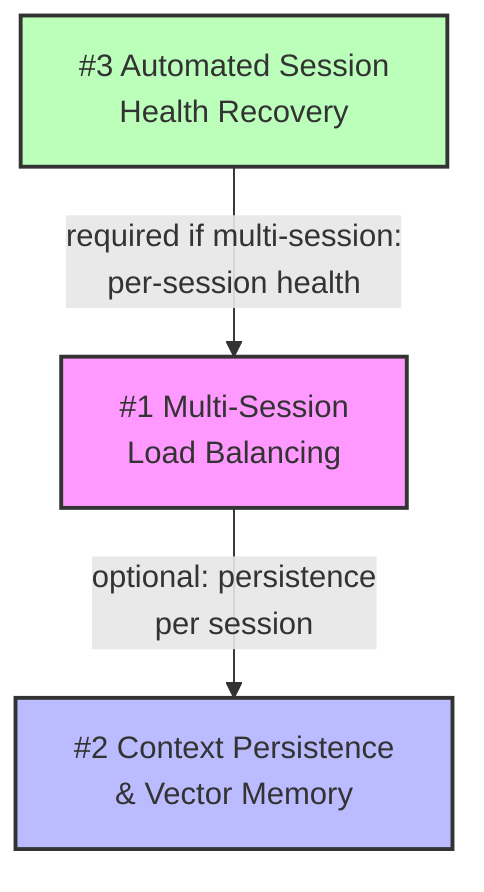

# 📋 Planning & Handoff — Future Roadmap

> **เอกสารฉบับนี้เป็นแผนงานและ Handoff สำหรับ 3 ฟีเจอร์ใน Future Roadmap**  
> สร้างเมื่อ: 2026-09-15 | Updated: 2026-09-15 (Commit `b5b1a21`)  
> สถานะปัจจุบัน: Production Ready — v4.2.0 + MCP Health Diagnostics (`check_bridge_health`, `list_bridge_models`) & GCP Hybrid Fallback เสร็จสมบูรณ์ (18/18 MCP Tests Passed)  

---

## สารบัญ

1. [ภาพรวม Current Architecture](#1-ภาพรวม-current-architecture)
2. [Roadmap Item #1 — Multi-Session Load Balancing](#2-roadmap-item-1--multi-session-load-balancing)
3. [Roadmap Item #2 — Context Persistence & Vector Memory](#3-roadmap-item-2--context-persistence--vector-memory)
4. [Roadmap Item #3 — Automated Session Health Recovery](#4-roadmap-item-3--automated-session-health-recovery)
5. [Dependency Graph & Execution Order](#5-dependency-graph--execution-order)
6. [Risk Assessment](#6-risk-assessment)
7. [Handoff Checklist](#7-handoff-checklist)

---

## 1. ภาพรวม Current Architecture

### 1.1 สถาปัตยกรรมปัจจุบัน (v4.2.0)

```text
┌────────────────────────────────────────────────────────────────┐
│                     AI Clients (HTTPS)                        │
│  Hermes · Cursor · Cline · Claude Code · Python SDK           │
└─────────────────────────┬──────────────────────────────────────┘
                          │ Bearer Token Auth
                          ▼
┌────────────────────────────────────────────────────────────────┐
│           Cloudflare Worker (gemini-web-bridge)                │
│                                                                │
│  ┌──────────────────────────────────────────────────────────┐  │
│  │        GeminiBridgeDO (Durable Object)                   │  │
│  │  ┌────────────────┐  ┌────────────┐  ┌───────────────┐  │  │
│  │  │ activeSocket   │  │ FIFO Queue │  │ Model Catalog │  │  │
│  │  │ (1 WSS conn)   │  │ (max 10)   │  │ (in-memory)   │  │  │
│  │  └────────────────┘  └────────────┘  └───────────────┘  │  │
│  └──────────────────────────────────────────────────────────┘  │
│                                                                │
│  Routing: idFromName("global-bridge") ← ★ Single Instance     │
└─────────────────────────┬──────────────────────────────────────┘
                          │ WSS Protocol v2
                          ▼
┌────────────────────────────────────────────────────────────────┐
│  Chrome Extension (1 Leader Tab)                              │
│  background.js → content.js → injected.js → Gemini Backend   │
└────────────────────────────────────────────────────────────────┘
```

### 1.2 Key Constraints ที่ต้องเข้าใจ

| Constraint | รายละเอียด | ไฟล์ที่เกี่ยวข้อง |
|:-----------|:-----------|:------------------|
| **Single DO Instance** | ใช้ `idFromName("global-bridge")` → มี DO เดียวทั่วโลก | `index.js:960` |
| **1 Active WebSocket** | `this.activeSocket` เก็บ connection เดียว, connection ใหม่จะ replace เก่า | `index.js:95,291` |
| **FIFO Queue** | 1 concurrent execution, max 10 waiters, 60s deadline | `index.js:220-234` |
| **In-Memory State** | Model catalog, conversation state, tokens — อยู่ใน RAM ไม่มี persistence | `index.js:92-116` |
| **Session-bound CSRF** | `SNlM0e` token อยู่ใน MAIN world เท่านั้น, ไม่ส่งข้าม WSS | `injected.js:12` |
| **Fail-Fast Policy** | 503 ถ้า Extension offline, 422 ถ้า model unverified, ไม่มี mock | `index.js:389,424` |

---

## 2. Roadmap Item #1 — Multi-Session Load Balancing

### 2.1 Problem Statement

ระบบปัจจุบันรองรับ Chrome Extension จาก **1 เครื่อง/บัญชีเท่านั้น** เนื่องจาก:
- Worker ใช้ `idFromName("global-bridge")` → DO instance เดียว
- `this.activeSocket` เก็บ WebSocket connection เดียว, connection ใหม่จะ `.close()` connection เก่า
- ไม่มี routing logic เพื่อกระจาย request ไปยังหลาย browser session

### 2.2 เป้าหมาย

- รองรับ Chrome Extension **หลายเครื่อง/หลายบัญชี** เชื่อมต่อพร้อมกัน
- กระจายโหลดของ AI Client requests ไปยังหลาย browser session
- เพิ่ม availability — ถ้า session หนึ่ง offline ยังใช้อีก session ได้

### 2.3 Architecture Design

```text
                          AI Clients
                              │
                              ▼
┌──────────────────────────────────────────────────────────────────┐
│                    Cloudflare Worker                              │
│                                                                  │
│  ┌────────────────────────────────────────────────────────────┐  │
│  │              BridgeRouterDO (New)                          │  │
│  │  • Registry ของ active sessions                            │  │
│  │  • Health tracking per session                             │  │
│  │  • Load balancing strategy (round-robin / least-loaded)    │  │
│  │  • idFromName("bridge-router")                             │  │
│  └─────────────────────────┬──────────────────────────────────┘  │
│                            │                                     │
│            ┌───────────────┼───────────────┐                     │
│            ▼               ▼               ▼                     │
│  ┌──────────────┐ ┌──────────────┐ ┌──────────────┐             │
│  │ BridgeDO #1  │ │ BridgeDO #2  │ │ BridgeDO #3  │             │
│  │ (Session A)  │ │ (Session B)  │ │ (Session C)  │             │
│  │ activeSocket │ │ activeSocket │ │ activeSocket │             │
│  │ modelCatalog │ │ modelCatalog │ │ modelCatalog │             │
│  └──────────────┘ └──────────────┘ └──────────────┘             │
│        │ WSS            │ WSS            │ WSS                   │
└────────┼────────────────┼────────────────┼───────────────────────┘
         ▼                ▼                ▼
   Chrome Ext A     Chrome Ext B     Chrome Ext C
   (Machine 1)      (Machine 2)      (Machine 3)
```

### 2.4 Implementation Plan

#### Phase 1: Session Registry (ประมาณ 3-5 วัน)

**ไฟล์ที่ต้องแก้ไข:**

| ไฟล์ | การเปลี่ยนแปลง |
|:-----|:--------------|
| `wrangler.toml` | เพิ่ม DO binding ใหม่ `BRIDGE_ROUTER` |
| `index.js` | แยก `GeminiBridgeDO` → เพิ่ม `BridgeRouterDO` class |
| `index.js:957-964` | เปลี่ยน entrypoint ให้ route ผ่าน Router ก่อน |

**`wrangler.toml` — เพิ่ม binding:**
```toml
[durable_objects]
bindings = [
  { name = "BRIDGE_DO", class_name = "GeminiBridgeDO" },
  { name = "BRIDGE_ROUTER", class_name = "BridgeRouterDO" }
]

[[migrations]]
tag = "v2"
new_sqlite_classes = ["BridgeRouterDO"]
```

**`BridgeRouterDO` — Core Logic:**
```javascript
export class BridgeRouterDO extends DurableObject {
  constructor(ctx, env) {
    super(ctx, env);
    this.sessions = new Map(); // sessionId → { lastSeen, queueDepth, modelCount }
  }

  // Extension connects with unique session ID
  async registerSession(sessionId, metadata) {
    this.sessions.set(sessionId, {
      lastSeen: Date.now(),
      queueDepth: 0,
      modelCount: metadata.modelCount || 0,
      status: "ready"
    });
  }

  // Select least-loaded session for client request
  selectSession() {
    const alive = [...this.sessions.entries()]
      .filter(([, s]) => s.status === "ready" && Date.now() - s.lastSeen < 30000);
    if (!alive.length) return null;
    alive.sort((a, b) => a[1].queueDepth - b[1].queueDepth);
    return alive[0][0];
  }
}
```

**Entrypoint change:**
```javascript
// เปลี่ยนจาก:
// const id = env.BRIDGE_DO.idFromName("global-bridge");

// เป็น:
export default {
  async fetch(request, env, ctx) {
    const url = new URL(request.url);

    // Extension WSS connects directly with session ID
    if (url.pathname === "/bridge") {
      const sessionId = url.searchParams.get("session") || "default";
      const id = env.BRIDGE_DO.idFromName(`session-${sessionId}`);
      return env.BRIDGE_DO.get(id).fetch(request);
    }

    // Client requests route through router
    const routerId = env.BRIDGE_ROUTER.idFromName("router");
    const router = env.BRIDGE_ROUTER.get(routerId);
    return router.fetch(request);
  }
};
```

#### Phase 2: Extension Session Identity (ประมาณ 2-3 วัน)

**ไฟล์ที่ต้องแก้ไข:**

| ไฟล์ | การเปลี่ยนแปลง |
|:-----|:--------------|
| `extension-cloudflare/settings.js` | เพิ่ม `sessionId` config field |
| `extension-cloudflare/content.js` | ส่ง `sessionId` ใน WSS connection URL |
| `extension-cloudflare/options.html/js` | UI สำหรับตั้ง session identity |

**content.js — เพิ่ม session ID:**
```javascript
// ปัจจุบัน:
// const wsUrl = `wss://${workerUrl}/bridge?token=${bridgeToken}`;

// เปลี่ยนเป็น:
const sessionId = settings.sessionId || `session-${crypto.randomUUID()}`;
const wsUrl = `wss://${workerUrl}/bridge?token=${bridgeToken}&session=${sessionId}`;
```

#### Phase 3: Health-Aware Load Balancing (ประมาณ 2-3 วัน)

- Heartbeat aggregation: Router DO รวบรวม health จากแต่ละ session DO
- Failover: ถ้า session offline, auto-reroute ไป session อื่น
- Sticky sessions (optional): client สามารถ pin to session ผ่าน header

### 2.5 Testing Strategy

| Test | ประเภท | คำอธิบาย |
|:-----|:------:|:---------|
| `multi-session-registry.test.mjs` | Unit | Register/deregister sessions, select least-loaded |
| `session-failover.test.mjs` | Unit | Session goes offline → requests route to alive session |
| `concurrent-sessions.test.mjs` | Integration | 2+ extensions connect simultaneously |

### 2.6 ข้อจำกัดและความเสี่ยง

> [!WARNING]
> - แต่ละ Durable Object instance มี **billing cost** แยก — ต้องคำนวณ cost ถ้ามีหลาย sessions
> - **Conversation state** ปัจจุบันอยู่ใน DO RAM — multi-session หมายความว่า multi-turn conversation ต้อง pin ไปที่ session เดิม
> - ต้องทดสอบว่า Google Gemini **rate limit** ทำงานอย่างไรเมื่อมีหลายบัญชี

---

## 3. Roadmap Item #2 — Context Persistence & Vector Memory

### 3.1 Problem Statement

ระบบปัจจุบัน **ไม่มีความจำระยะยาว**:
- `conversationState` (conversationId, responseId, choiceId) อยู่ใน RAM → หายเมื่อ DO restart
- ไม่มี semantic search ข้ามบทสนทนา
- ไม่มี knowledge base สำหรับ SDLC tools

### 3.2 เป้าหมาย

- เก็บประวัติบทสนทนาและ context ข้ามเซสชัน
- รองรับ semantic search (RAG) สำหรับ MCP tools
- ใช้ Cloudflare D1 (SQL) + Vectorize (embedding) เป็น storage layer

### 3.3 Architecture Design

```text
┌──────────────────────────────────────────────────────────────┐
│                    GeminiBridgeDO                             │
│                                                              │
│  ┌──────────┐  ┌──────────────┐  ┌───────────────────────┐  │
│  │ RAM State│→ │ D1 Database  │→ │ Vectorize Index       │  │
│  │ (hot)    │  │ (persistent) │  │ (semantic embeddings) │  │
│  └──────────┘  └──────────────┘  └───────────────────────┘  │
│                       │                      │               │
│                       ▼                      ▼               │
│  ┌──────────────────────────────────────────────────────┐   │
│  │              Context Manager (New Module)             │   │
│  │  • saveConversation()  • searchContext()              │   │
│  │  • getHistory()        • pruneStaleContexts()        │   │
│  └──────────────────────────────────────────────────────┘   │
└──────────────────────────────────────────────────────────────┘
```

### 3.4 Implementation Plan

#### Phase 1: D1 Schema & Conversation Persistence (ประมาณ 3-4 วัน)

**ไฟล์ใหม่ที่ต้องสร้าง:**

| ไฟล์ | หน้าที่ |
|:-----|:--------|
| `cloudflare-worker/src/context-store.js` | D1 CRUD operations |
| `cloudflare-worker/migrations/0001_conversations.sql` | D1 schema |

**`wrangler.toml` — เพิ่ม D1 binding:**
```toml
[[d1_databases]]
binding = "BRIDGE_DB"
database_name = "gemini-bridge-context"
database_id = "<auto-generated>"
```

**D1 Schema (`0001_conversations.sql`):**
```sql
CREATE TABLE conversations (
  id TEXT PRIMARY KEY,           -- conversationId from Gemini
  session_id TEXT NOT NULL,      -- bridge session identity
  model TEXT NOT NULL,           -- model used
  created_at INTEGER NOT NULL,   -- unix timestamp
  updated_at INTEGER NOT NULL,
  message_count INTEGER DEFAULT 0,
  metadata TEXT                  -- JSON blob
);

CREATE TABLE messages (
  id INTEGER PRIMARY KEY AUTOINCREMENT,
  conversation_id TEXT NOT NULL REFERENCES conversations(id),
  role TEXT NOT NULL,             -- system/user/assistant/tool
  content TEXT NOT NULL,
  tool_calls TEXT,                -- JSON array if present
  token_estimate INTEGER,
  created_at INTEGER NOT NULL,
  FOREIGN KEY (conversation_id) REFERENCES conversations(id)
);

CREATE INDEX idx_messages_conv ON messages(conversation_id, created_at);
CREATE INDEX idx_conversations_session ON conversations(session_id, updated_at DESC);
```

**`context-store.js` — Core Module:**
```javascript
export class ContextStore {
  constructor(db) { this.db = db; }

  async saveMessage(conversationId, sessionId, model, message) {
    const now = Date.now();

    // Upsert conversation
    await this.db.prepare(`
      INSERT INTO conversations (id, session_id, model, created_at, updated_at, message_count)
      VALUES (?1, ?2, ?3, ?4, ?4, 1)
      ON CONFLICT(id) DO UPDATE SET
        updated_at = ?4,
        message_count = message_count + 1
    `).bind(conversationId, sessionId, model, now).run();

    // Insert message
    await this.db.prepare(`
      INSERT INTO messages (conversation_id, role, content, tool_calls, token_estimate, created_at)
      VALUES (?1, ?2, ?3, ?4, ?5, ?6)
    `).bind(
      conversationId,
      message.role,
      message.content || "",
      message.tool_calls ? JSON.stringify(message.tool_calls) : null,
      Math.ceil((message.content || "").length / 4),
      now
    ).run();
  }

  async getHistory(conversationId, limit = 20) {
    const { results } = await this.db.prepare(`
      SELECT role, content, tool_calls, created_at
      FROM messages WHERE conversation_id = ?1
      ORDER BY created_at DESC LIMIT ?2
    `).bind(conversationId, limit).all();
    return results.reverse();
  }

  async pruneOlderThan(days = 30) {
    const cutoff = Date.now() - (days * 86400000);
    await this.db.prepare(`DELETE FROM messages WHERE created_at < ?1`).bind(cutoff).run();
    await this.db.prepare(`DELETE FROM conversations WHERE updated_at < ?1`).bind(cutoff).run();
  }
}
```

#### Phase 2: Vectorize Embeddings & Semantic Search (ประมาณ 5-7 วัน)

**`wrangler.toml` — เพิ่ม Vectorize binding:**
```toml
[[vectorize]]
binding = "CONTEXT_INDEX"
index_name = "gemini-bridge-context"
```

**ไฟล์ใหม่:**

| ไฟล์ | หน้าที่ |
|:-----|:--------|
| `cloudflare-worker/src/vector-memory.js` | Embedding + search logic |

**`vector-memory.js` — Core Module:**
```javascript
export class VectorMemory {
  constructor(vectorize, contextStore) {
    this.vectorize = vectorize;
    this.store = contextStore;
  }

  async indexMessage(conversationId, messageId, content) {
    // ใช้ Cloudflare AI Gateway หรือ Workers AI สำหรับ embedding
    const vector = await this.embed(content);
    await this.vectorize.upsert([{
      id: `${conversationId}:${messageId}`,
      values: vector,
      metadata: { conversationId, messageId, preview: content.slice(0, 200) }
    }]);
  }

  async searchContext(query, topK = 5) {
    const queryVector = await this.embed(query);
    const results = await this.vectorize.query(queryVector, { topK });
    return results.matches.map(m => ({
      conversationId: m.metadata.conversationId,
      preview: m.metadata.preview,
      score: m.score
    }));
  }

  async embed(text) {
    // Option A: Cloudflare Workers AI (@cf/baai/bge-base-en-v1.5)
    // Option B: External embedding API
    // ต้องเลือกตามข้อจำกัดด้านภาษา (Thai support)
  }
}
```

#### Phase 3: MCP Tool Integration (ประมาณ 2-3 วัน)

เพิ่ม context retrieval เข้า SDLC tools:

```javascript
// ใน index.js MCP handler
if (toolName === "sdlc_solution_architect") {
  // ดึง relevant context จาก vector memory
  const relatedContexts = await vectorMemory.searchContext(args.problem_description, 3);
  const contextBlock = relatedContexts.map(c => c.preview).join("\n---\n");

  prompt = `[Role: Senior Solution Architect]
[Previous Related Discussions:]
${contextBlock}

Problem: ${args.problem_description}
...`;
}
```

### 3.5 Testing Strategy

| Test | ประเภท | คำอธิบาย |
|:-----|:------:|:---------|
| `context-store.test.mjs` | Unit | CRUD operations, prune, history retrieval |
| `vector-memory.test.mjs` | Unit | Embedding mock, search relevance |
| `context-integration.test.mjs` | Integration | MCP tool with context enrichment |

### 3.6 ข้อจำกัดและความเสี่ยง

> [!CAUTION]
> - **D1 มี row limit**: Free plan = 5M rows/month reads, 100K writes/day → ต้อง prune เป็นประจำ
> - **Vectorize pricing**: ต้องคำนวณ cost ตามจำนวน vectors
> - **Thai language embeddings**: `bge-base-en-v1.5` อาจไม่รองรับภาษาไทยดี → ต้องทดสอบ multilingual model
> - **Privacy**: ข้อความที่เก็บใน D1/Vectorize จะอยู่บน Cloudflare → ต้องพิจารณา data retention policy

---

## 4. Roadmap Item #3 — Automated Session Health Recovery

### 4.1 Problem Statement

ระบบปัจจุบัน **ไม่มีกลไกตรวจจับ session หมดอายุ**:
- ถ้า Chrome Extension disconnect → ระบบตอบ 503 ทันที แต่ไม่แจ้งเตือนผู้ใช้
- ถ้า Google session (cookie) หมดอายุ → Extension ยังเชื่อมต่ออยู่แต่ request จะ fail ด้วย auth error จาก Google
- ไม่มี Webhook/notification เมื่อระบบ unhealthy

### 4.2 เป้าหมาย

- ตรวจจับ session stale/expired อัตโนมัติ
- แจ้งเตือนผู้ใช้ผ่าน Webhook (Discord, Slack, Email)
- Auto-recovery: ลอง re-authenticate หรือ prompt ให้ user refresh

### 4.3 Architecture Design

```text
┌──────────────────────────────────────────────────────────────┐
│                    GeminiBridgeDO                             │
│                                                              │
│  ┌──────────────────────────────────────────────────────┐   │
│  │           Health Monitor (New)                        │   │
│  │  • Cron: ตรวจสอบทุก 5 นาที                            │   │
│  │  • Track: last successful generation timestamp        │   │
│  │  • Track: consecutive error count                     │   │
│  │  • Track: session token validity (via test request)   │   │
│  └───────────────────────┬──────────────────────────────┘   │
│                          │                                   │
│                          ▼                                   │
│  ┌──────────────────────────────────────────────────────┐   │
│  │           Notification Dispatcher (New)               │   │
│  │  • Webhook URL (configurable via env var)             │   │
│  │  • Discord / Slack / Generic webhook                  │   │
│  │  • Throttle: ไม่แจ้งซ้ำภายใน 15 นาที                   │   │
│  └──────────────────────────────────────────────────────┘   │
└──────────────────────────────────────────────────────────────┘
```

### 4.4 Implementation Plan

#### Phase 1: Health Monitoring (ประมาณ 2-3 วัน)

**ไฟล์ที่ต้องแก้ไข/สร้าง:**

| ไฟล์ | การเปลี่ยนแปลง |
|:-----|:--------------|
| `wrangler.toml` | เพิ่ม Cron Trigger |
| `index.js` | เพิ่ม `alarm()` handler ใน GeminiBridgeDO |
| `cloudflare-worker/src/health-monitor.js` | Health check logic (New) |

**`wrangler.toml` — เพิ่ม Cron:**
```toml
[triggers]
crons = ["*/5 * * * *"]  # ทุก 5 นาที
```

**Health state tracking ใน GeminiBridgeDO:**
```javascript
// เพิ่มใน constructor
this.healthState = {
  lastSuccessfulGeneration: null,  // timestamp
  consecutiveErrors: 0,
  lastError: null,
  lastHealthCheck: null,
  sessionValid: null               // true/false/null (unknown)
};

// เพิ่ม alarm handler
async alarm() {
  const health = await this.checkHealth();

  if (health.status === "unhealthy") {
    await this.dispatchNotification({
      level: "warning",
      title: "Gemini Web Bridge — Session Unhealthy",
      details: health
    });
  }

  if (health.status === "critical") {
    await this.dispatchNotification({
      level: "critical",
      title: "Gemini Web Bridge — Session Down",
      details: health
    });
  }

  // Schedule next check
  this.ctx.storage.setAlarm(Date.now() + 300_000); // 5 minutes
}

async checkHealth() {
  const now = Date.now();
  const checks = {
    extensionConnected: this.isExtensionReady(),
    lastGeneration: this.healthState.lastSuccessfulGeneration,
    timeSinceLastGeneration: this.healthState.lastSuccessfulGeneration
      ? now - this.healthState.lastSuccessfulGeneration
      : null,
    consecutiveErrors: this.healthState.consecutiveErrors,
    modelCount: this.dynamicModels.length
  };

  if (!checks.extensionConnected) return { status: "critical", ...checks };
  if (checks.consecutiveErrors >= 3) return { status: "unhealthy", ...checks };
  if (checks.modelCount === 0) return { status: "degraded", ...checks };
  return { status: "healthy", ...checks };
}
```

#### Phase 2: Webhook Notification (ประมาณ 1-2 วัน)

**`wrangler.toml` — เพิ่ม env var:**
```toml
[vars]
WEBHOOK_URL = ""           # Discord/Slack webhook URL
NOTIFY_THROTTLE_MS = 900000  # 15 minutes
```

**`health-monitor.js` — Notification Module:**
```javascript
export class NotificationDispatcher {
  constructor(webhookUrl, throttleMs = 900000) {
    this.url = webhookUrl;
    this.throttle = throttleMs;
    this.lastNotification = 0;
  }

  async dispatch(payload) {
    if (!this.url) return;
    if (Date.now() - this.lastNotification < this.throttle) return;

    await fetch(this.url, {
      method: "POST",
      headers: { "Content-Type": "application/json" },
      body: JSON.stringify({
        // Discord-compatible format
        embeds: [{
          title: payload.title,
          description: JSON.stringify(payload.details, null, 2),
          color: payload.level === "critical" ? 0xFF0000 : 0xFFAA00,
          timestamp: new Date().toISOString()
        }]
      })
    });

    this.lastNotification = Date.now();
  }
}
```

#### Phase 3: Session Recovery Hints (ประมาณ 2-3 วัน)

**Extension-side enhancements:**

| ไฟล์ | การเปลี่ยนแปลง |
|:-----|:--------------|
| `content.js` | เพิ่ม `HEALTH_CHECK` message handler |
| `injected.js` | เพิ่ม test fetch เพื่อตรวจ session validity |

```javascript
// content.js — respond to health probes from Worker
if (msg.type === "HEALTH_CHECK") {
  // ส่ง test request เพื่อตรวจว่า Google session ยัง valid
  window.postMessage({
    type: "GEMINI_BRIDGE_HEALTH_PROBE",
    requestId: msg.requestId
  }, "*");
}

// injected.js — lightweight session validity check
async function probeSessionHealth() {
  try {
    const resp = await originalFetch("https://gemini.google.com/_/BardChatUi/data/batchexecute", {
      method: "HEAD",
      credentials: "include"
    });
    return resp.status === 200;
  } catch {
    return false;
  }
}
```

### 4.5 Health Dashboard Enhancement

เพิ่ม health details เข้า `/health` endpoint:

```javascript
// เพิ่มใน status dashboard response
health_monitoring: {
  enabled: Boolean(this.env.WEBHOOK_URL),
  last_check: this.healthState.lastHealthCheck,
  last_successful_generation: this.healthState.lastSuccessfulGeneration,
  consecutive_errors: this.healthState.consecutiveErrors,
  status: healthStatus  // healthy/degraded/unhealthy/critical
}
```

### 4.6 Testing Strategy

| Test | ประเภท | คำอธิบาย |
|:-----|:------:|:---------|
| `health-monitor.test.mjs` | Unit | Status determination logic |
| `notification-throttle.test.mjs` | Unit | Throttle prevents spam |
| `health-probe.test.mjs` | Unit | Extension health check response |

### 4.7 ข้อจำกัดและความเสี่ยง

> [!NOTE]
> - Cron Triggers บน Cloudflare Workers มี **minimum interval 1 นาที** (Free plan) → 5 นาทีเหมาะสม
> - Durable Object `alarm()` เป็นทางเลือกที่ดีกว่า Cron สำหรับ per-instance health check
> - **HEAD request** ไปที่ Google อาจถูก rate limit ถ้าเรียกบ่อยเกินไป

---

## 5. Dependency Graph & Execution Order



### คำแนะนำลำดับการทำงาน

| ลำดับ | Roadmap Item | เหตุผล | ประมาณเวลา |
|:-----:|:-------------|:-------|:----------:|
| 🥇 1 | **#3 Health Recovery** | ผลกระทบสูงสุดต่อ reliability, ซับซ้อนน้อยสุด, ไม่ต้องพึ่ง item อื่น | 5-8 วัน |
| 🥈 2 | **#2 Context Persistence** | เพิ่มคุณค่าให้ MCP tools, ใช้ D1/Vectorize ที่ Cloudflare มีพร้อม | 10-14 วัน |
| 🥉 3 | **#1 Multi-Session** | ซับซ้อนสูงสุด, ต้อง redesign routing, ยังไม่มี use case เร่งด่วน | 7-11 วัน |

---

## 6. Risk Assessment

| ความเสี่ยง | ผลกระทบ | ความน่าจะเป็น | การบรรเทา |
|:-----------|:-------:|:-------------:|:----------|
| Google เปลี่ยน DOM structure → model selector / health probe พัง | 🔴 High | 🟡 Medium | ใช้ fail-closed design (มีอยู่แล้ว), เพิ่ม health notification |
| D1/Vectorize cost เกิน Free tier | 🟡 Medium | 🟡 Medium | ตั้ง prune policy, monitor usage |
| Multi-session ทำให้ debug ยากขึ้น | 🟡 Medium | 🟢 Low | เพิ่ม session ID ใน log, X-Session-Id header |
| Google rate limit เมื่อมีหลาย sessions | 🔴 High | 🟡 Medium | ใช้ต่างบัญชี, ตั้ง per-session rate limit |
| Thai embedding quality ไม่ดี | 🟡 Medium | 🟡 Medium | ทดสอบ multilingual models, fallback to keyword search |

---

## 7. Handoff Checklist

### สำหรับ Developer คนถัดไป

- [ ] อ่านและเข้าใจ [ARCHITECTURE.md](ARCHITECTURE.md) — โดยเฉพาะ Section 2 (Security Boundaries) และ Section 4 (Fail-Fast Policy)
- [ ] เข้าใจ Protocol v2 message flow: `SESSION_READY` → `PREPARE_MODEL` → `MODEL_READY` → `EXECUTE_REQUEST` → `STREAM_CHUNK` → `STREAM_DONE`
- [ ] ทำความเข้าใจ `GeminiBridgeDO` class ใน `index.js` — ทุก state อยู่ใน constructor lines 91-116
- [ ] รัน test suite: `node --test cloudflare-worker/tests/*.test.mjs` (คาดหวัง 54 pass, 4 pre-existing fail)
- [ ] ตรวจสอบ production health: `curl https://gemini-web-bridge.pphothidaen.workers.dev/`
- [ ] ตรวจสอบ Cloudflare Dashboard: Durable Objects metrics, Worker analytics

### ไฟล์สำคัญที่ต้องรู้จัก

| ไฟล์ | หน้าที่ | Touch Points |
|:-----|:--------|:-------------|
| [`index.js`](cloudflare-worker/src/index.js) | Core Worker + DO + API routes | ทุก Roadmap item |
| [`model-catalog.js`](cloudflare-worker/src/model-catalog.js) | Model normalization & recommendation | #1 Multi-Session |
| [`tool-emulator.ts`](cloudflare-worker/src/tool-emulator.ts) | OpenAI Tool Calling emulation | #2 Context Memory |
| [`content.js`](extension-cloudflare/content.js) | WSS client + model selection | #1, #3 |
| [`injected.js`](extension-cloudflare/injected.js) | MAIN world RPC interceptor | #3 Health Probe |
| [`background.js`](extension-cloudflare/background.js) | Tab coordinator | #1 Multi-Session |
| [`wrangler.toml`](cloudflare-worker/wrangler.toml) | DO bindings, env vars, cron | ทุก Roadmap item |

### Environment Secrets ที่ต้องรู้

| Secret | ใช้สำหรับ | ตั้งค่าผ่าน |
|:-------|:---------|:-----------|
| `BRIDGE_AUTH_TOKEN` | Extension ↔ Worker WSS auth | `wrangler secret put BRIDGE_AUTH_TOKEN` |
| `CLIENT_API_TOKEN` | Client → Worker API auth | `wrangler secret put CLIENT_API_TOKEN` |
| `WEBHOOK_URL` (ใหม่ #3) | Health notification webhook | `wrangler secret put WEBHOOK_URL` |

---

> [!IMPORTANT]
> **เอกสารนี้เป็น living document** — ควรอัปเดตเมื่อเริ่มทำแต่ละ Roadmap Item โดยย้ายจาก TODO → DOING → DONE พร้อมบันทึก decisions และ deviations จากแผนเดิม
